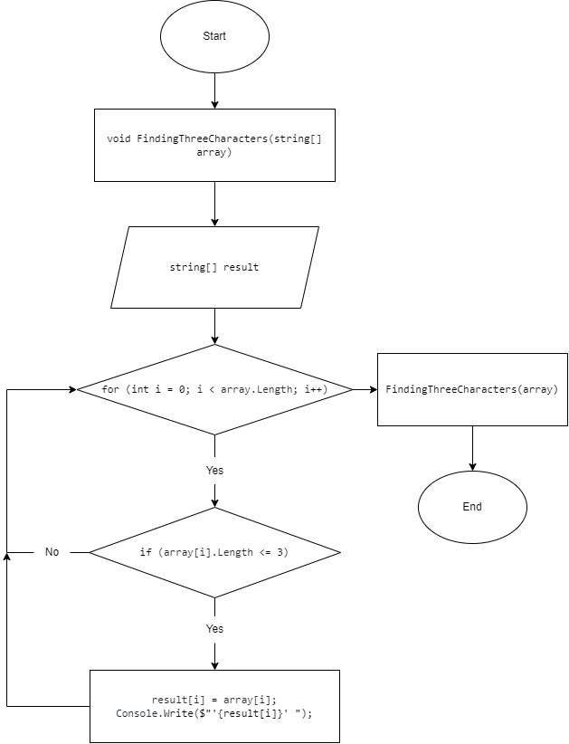

# **Итоговая проверочная работа**
## План работы
1. _Создать репозиторий на **GitHub**._
2. _Нарисовать **блок-схему** алгоритма._
3. *Снабдить репозиторий оформленым текстовым __описанием решения__.*
4. *__Написать программу__, решающую поставленную задачу.*
5. *Использовать контроль версий в работе над этим проектом.*

## Задача
*Написать программу, которая из имеющегося массива строк формирует новый массив из строк, длина которых меньше, либо равна __3 символам__. Первоначальный массив можно ввести с клавиатуры, либо задать на старте выполнения алгоритма. При решении не рекомендуется пользоваться коллекциями, лучше обойтись исключительно массивами.*

### Решение
1. Создаем пустой массив, вводимый пользователем через клавиатуру.
2. Метод печати изначального массива.
3. Решение задачи. Вывод массива по условию.
4. Печать первоначального пассива и итогового по условию задания.

## Содержание
+ Ссылка на [GitHub](https://github.com/nikita-gorbachew/ControlWork.git)
+ Блок схема заполнения нового массива:
+ 
